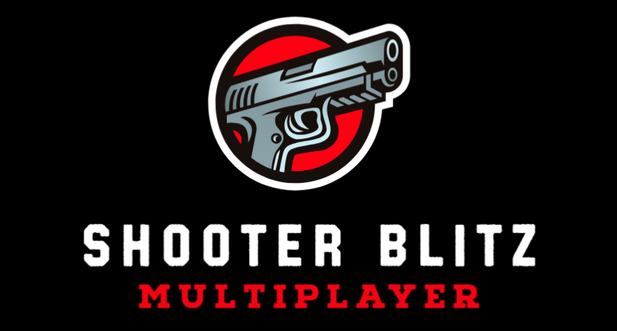

# Shooter Blitz

## Description

The project chosen is a simple top-view 3D shooter game where players will engage in combat against other players. The game environment is set in a desolate urban wasteland littered with debris, garbage, and broken cars. Massive shipping containers and barrels dot the landscape, providing cover and obstacles for players to navigate. Amidst the wreckage, makeshift shelters constructed from water tanks and small "container"-like houses offer temporary refuge. The goal of the game is to eliminate as many opposing players as possible.

The inspiration for this project stems from our childhood of playing countless hours of Boxhead as well as Minecraft. By using techniques we learned in class and also from online tutorials, we were able to model, animate, and program in R3F (ThreeJS), and we were able to create our vision of a 3D game similar to Boxhead but with a new environment and added Minecraft characters. Through this game, we were able to showcase what we learned by applying 3D graphics and animation in a shooter game genre.

## How to run the game

The project is available online, and it can be also run locally. If you want to try the online version, simply visit https://shooter-blitz.pages.dev. If you want to try locally, Node.js and npm must be installed on your PC. To run the program, simply follow the steps below:

0. Open terminal and clone the repository using `git clone https://github.com/ubergonmx/shooter-blitz.git`
1. Navigate to the project using `cd shooter-blitz`
2. Type `npm install`
3. Type `npm run dev`
4. Open any browser and type what the console prints (e.g., localhost:5137)
5. Click `Launch` to start the game; WASD for controls, and Space for Fire if you prefer to use a keyboard.

If you want to play on **LAN**, replace `dev` with `demo` in step 3 and type the provided **Network URL**. In this way, you can also play using either **desktop** or **mobile devices**.

## Credits

Team

- [aaronpal](https://github.com/ubergonmx) - programmer
- [SeanUmpad](https://github.com/SeanUmpad) - modeling and animation of the main character models

Others

- [wass88](https://github.com/wass08/r3f-vite-starter) - starter template of R3F project
- [quaternius](https://quaternius.com/packs/toonshootergamekit.html) - creator of Toon Shooter Game Kit
